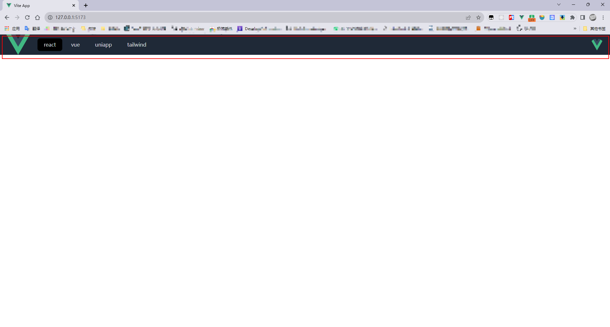
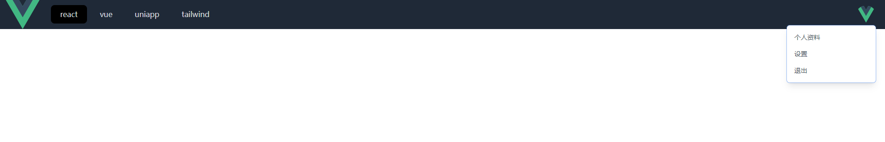

---

#### 1.实现头部导航栏效果图





#### 2.代码

```vue
<template>
  <div class="w-full h-full">
    <header class="h-16 bg-gray-800 flex text-gray-300 px-5">
      <a href="#" class="mr-5">
        
      </a>
      <nav class="flex items-center">
        <a href="#" class="bg-black px-5 py-2 mx-1 rounded-lg hover:bg-black"
          >react</a
        >
        <a href="#" class="px-5 py-2 mx-1 rounded-lg hover:bg-black">vue</a>
        <a href="#" class="px-5 py-2 mx-1 rounded-lg hover:bg-black">uniapp</a>
        <a href="#" class="px-5 py-2 mx-1 rounded-lg hover:bg-black"
          >tailwind</a
        >
      </nav>
      <div class="group ml-auto relative flex items-center ">
        
        <div
          class="absolute bg-white text-gray-700 text-sm top-14 right-0 shadow-lg w-48 ring-1 ring-blcak ring-opacity-5 py-2 rounded-md scale-0 group-hover:scale-100 duration-300 origin-top-right"
        >
          <a href="#" class="text-gray-600 block px-4 py-2 hover:bg-gray-100"
            >个人资料</a
          >
          <a href="#" class="text-gray-600 block px-4 py-2 hover:bg-gray-100"
            >设置</a
          >
          <a href="#" class="text-gray-600 block px-4 py-2 hover:bg-gray-100"
            >退出</a
          >
        </div>
      </div>
    </header>
  </div>
</template>

<script setup lang="ts"></script>

<style scoped></style>
```

---
