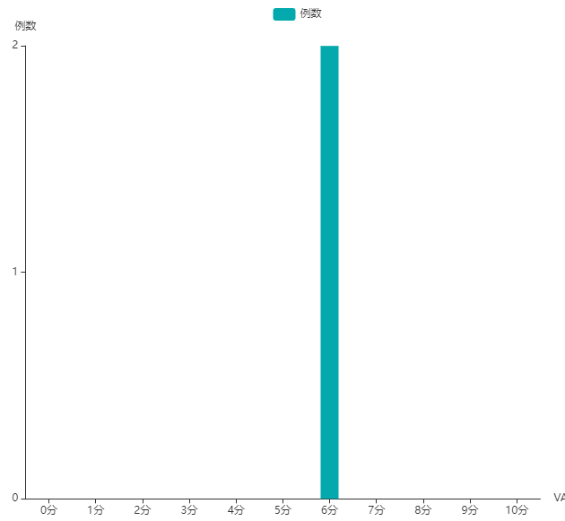

---

### 1. X 轴刻度显示不完整,如图所示



### 2. 解决方法，调整 gird 的 left、right 值

```js
let option = {
    ...
    grid: {
        left: '3%',
        right: '10%',
        bottom: '3%',
        top: '8%',
        containLabel: true
    }
    ...
}
```

---
