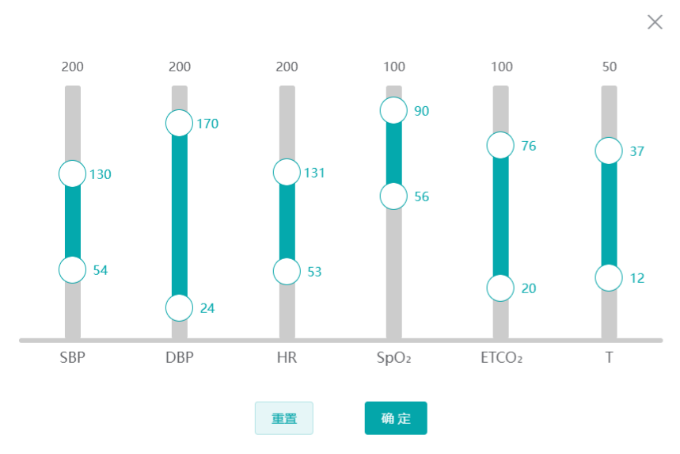

---

### 前言

实现 el-sider 选中的值一直显示，发现官方文档没有直接设置的属性，最后发现 marks 属性有些相像设置固定标记

### 实现

直接开干，监听 input 事件动态赋值 marks 对象

部分代码：

```js
<div
    class="prebar"
    v-for="(item, index) in dataWarningList"
    :key="item + index"
    >
      <div>{{ item.param_h }}</div>
      <el-slider
          v-model="item.value"
          vertical
          height="100%"
          range
          :min="Number(item.param_l)"
          :max="Number(item.param_h)"
          :marks="item.marks"
          @input="handleChangeValue"
          :show-tooltip="false"
      >
      </el-slider>
      <div class="prebarWord">
        <span>{{ item.description }}</span>
      </div>
</div>
......
//设置滑块显示值
handleChangeValue() {
    this.dataWarningList.forEach((item, index) => {
        item.marks = {
            [item.value[1]]: {
                style: {
                    color: '#04a9ad',
                    marginLeft: '15px',
                    minWidth: '30px'
                },
                label: this.$createElement('div', item.value[1])
            },
            [item.value[0]]: {
                style: {
                    color: '#04a9ad',
                    marginLeft: '15px',
                    minWidth: '30px',
                    fontSize: '20px'
                },
                label: this.$createElement('div', item.value[0])
            }
        }
    })
},
```

### 效果


本文到此结束，水平有限欢迎指正。

---
