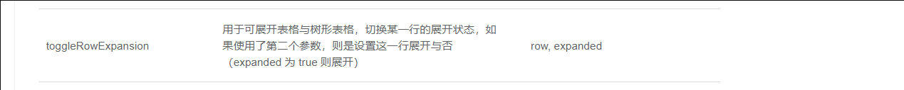
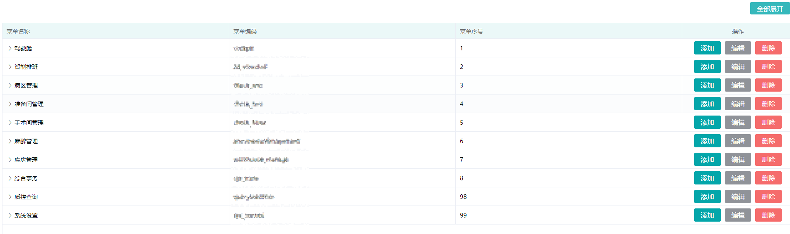
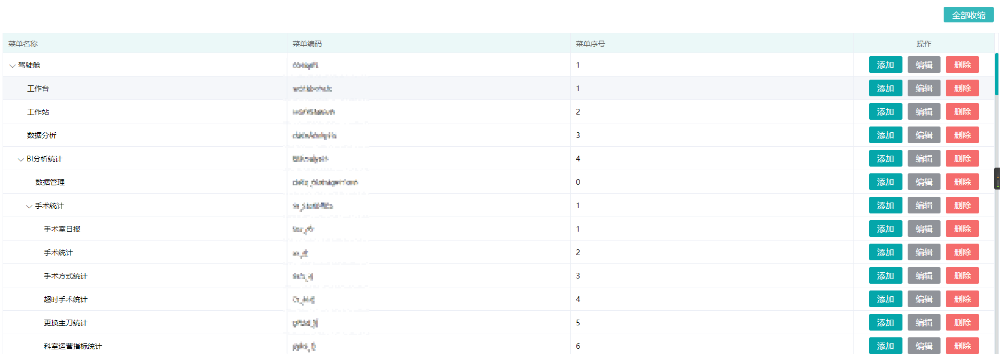

---
### 1. 全部展开和收缩

根据 element-ui 文档的 toggleRowExpansion


先在 data 里定义 isExpansion 为 false，同时 el-table 的 default-expand-all 默认全部收缩，当点击按钮，this.isExpansion 取反；

遍历得到 row 和布尔值 isExpansion，通过 ref 找到 table 执行方法 toggleRowExpansion(row, expanded)

```js
methods: {
    // 切换数据表格树形展开
    toggleRowExpansion() {
      this.isExpansion = !this.isExpansion;
      this.toggleRowExpansionAll(this.menuList, this.isExpansion);
    },
    toggleRowExpansionAll(data, isExpansion) {
      data.forEach((item) => {
        this.$refs.dataTreeList.toggleRowExpansion(item, isExpansion);
        if (item.children !== undefined && item.children !== null) {
          this.toggleRowExpansionAll(item.children, isExpansion);
        }
      });
    },
  },
```


### 2. 页面效果





### 3.页面代码

```html
<el-table
  ref="dataTreeList"
  size="mini"
  :header-cell-style="{ background: '#ebf8f8' }"
  :data="menuList"
  height="100%"
  row-key="id"
  border
  :default-expand-all="isExpansion"
  :tree-props="{ children: 'children', hasChildren: 'hasChildren' }"
>
  <el-table-column prop="name" label="菜单名称"> </el-table-column>
  <el-table-column prop="code" label="菜单编码"> </el-table-column>
  <el-table-column prop="seq" label="菜单序号"> </el-table-column>
  <el-table-column align="center" width="270" prop="name" label="操作">
    <template #default="{row}">
      <div class="btn">
        <el-button type="primary" size="mini" @click="handleDialog(row, 'add')">
          添加
        </el-button>
        <el-button type="info" size="mini" @click="handleDialog(row, 'edit')">
          编辑
        </el-button>
        <el-button type="danger" size="mini" @click="remove(row)">
          删除
        </el-button>
      </div>
    </template>
  </el-table-column>
</el-table>
```
---
