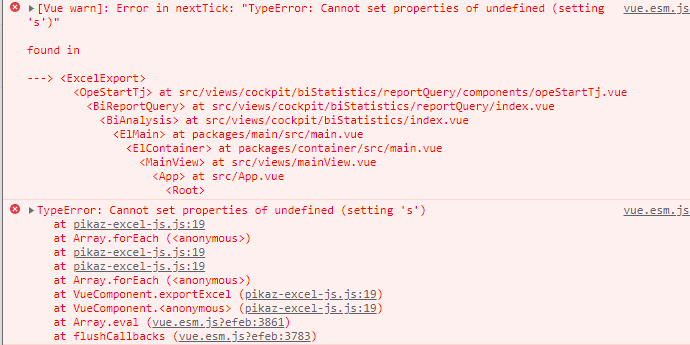

---

### 1. 插件简单介绍

- 支持导出 excel 文件，并可设置列宽，边框，字体，字体颜色，字号，对齐方式，背景色等样式。
- 支持 excel 文件导入，生成 json 数据，考虑到客户端机器性能，导入大量数据时，推荐拆分数据分成多个文件导入。

具体可查看官网。

### 2.报错信息

导出时报了如下错误


### 3.错误原因

​ 调试最后发现是后端接口返回的数据包含 null，导致在设置导出列样式的时候报错

### 4.解决办法

​ 导出时循环数组里的对象，如果对象里的某个属性包含 null，则手动设置为空字符串。

这样在后续处理合并列和设置列样式就不会报这个错误了。

```js
this.mergeRoomIndex = []
this.bgIndex = []
let i = 3
this.ssktTable.forEach(item => {
    for (let sub in item) {
        if (item[sub] === null) item[sub] = ''
    }
    item.idx = i
    if (item.bg_flag === '1') { // 用于单独设置导出的某一行的背景色标识符
        this.bgIndex.push(i)
    }
    i++
})
// 将相同的room_name的行进行合并
const result = this.ssktTable.reduce((prev, cur) => {
    let index = -1
    prev.some((item, i) => {
        if (item.room_name == cur.room_name) {
            index = i
            return true
        }
    })
    if (index > -1) {
        prev[index].group.push(cur.idx)
    } else {
        prev.push({
            room_name: cur.room_name,
            group: [cur.idx]
        })
    }
    return prev
}, [])
// 设置需要合并的单元格
result.forEach(item => {
    if (item.group.length >= 2) {
        this.mergeRoomIndex.push(
            `A${item.group[0]}:A${item.group[item.group.length - 1]}`
        )
    }
})
......
// 其他代码
......
// 设置特定的行背景色
this.bgIndex.forEach(item => {
    this.bgEn.forEach(en => {
        this.sheet[0].cellStyle.push({
            cell: `${en}${item}`,
            fill: {
                fgColor: { rgb: 'ffff00' }
            }
        })
    })
})
```

## 本次分享到此结束，如有问题欢迎评论。
