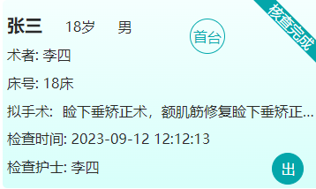

---

#### 1.前言

> 斜角标签是前端`toC`开发常见的场景，其效果图大概如下：



#### 2.思路

主要在卡片的盒子内新建一个长条的标签盒子，通过定位的方式调整位置，然后再通过变形`transform: rotate(45deg)`，旋转 45 度角，超出卡片盒子的部分设置`overflow:hidden`;

#### 3.代码

```vue
<div class="card">
   <div class="tag">核查完成</div>
</div>

<style scoped>
.card{
  width:200px;
  height:200px;
  overflow: hidden; // 隐藏标签的超出部分
  position: relative;
}
.tag {
    text-align: center; // 文本居中
    position: absolute; // 绝对定位
    color: #fff;
    // 以下属性会影响斜边标签的显示
    width: 30%;
    height: 18px;
    line-height: 18px;
    top: 10%;
    left: 76%;
    transform: rotate(45deg);
  }
</style>
```

    这里要注意，旋转的中心默认是以中心旋转，这会导致转45度会出现显示不全、显示不出文本等情况，而修改transform-origin也是没用的，无论它以哪个点，只旋转的话都是会显示不全的；

所以需要调节其位置，配合 width，让其出现在合理的位置，最好是根据父元素的大小来决定其位置和大小，这样即使父元素大小不确定也能正确出现在角落.

---
