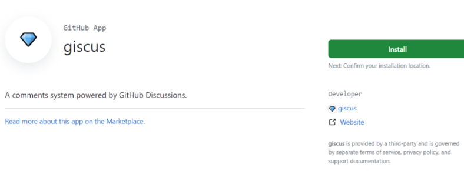
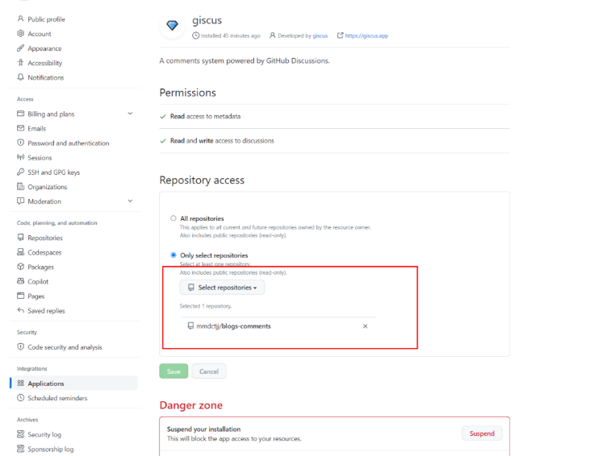
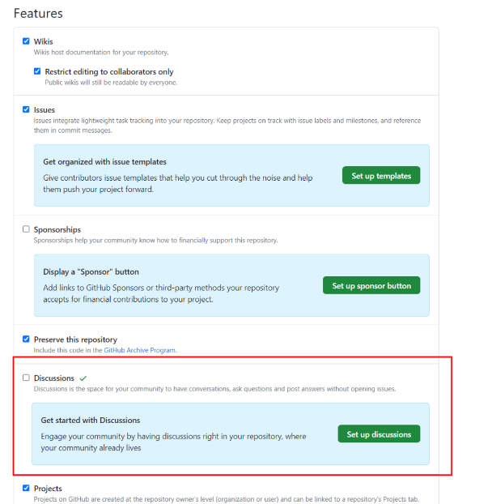
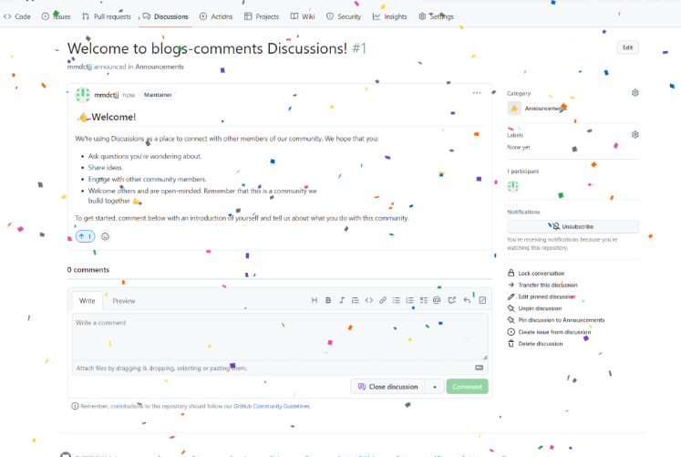
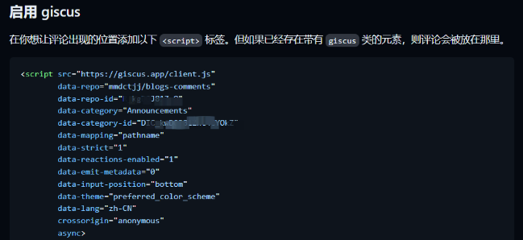

### VuePress 介绍

​ VuePress 由两部分组成：第一部分是一个极简静态网站生成器 (opens new window)，它包含由 Vue 驱动的主题系统和插件 API，另一个部分是为书写技术文档而优化的默认主题，它的诞生初衷是为了支持 Vue 及其子项目的文档需求。每一个由 VuePress 生成的页面都带有预渲染好的 HTML，也因此具有非常好的加载性能和搜索引擎优化（SEO）。同时，一旦页面被加载，Vue 将接管这些静态内容，并将其转换成一个完整的单页应用（SPA），其他的页面则会只在用户浏览到的时候才按需加载。

[vuePress官方文档]: https://vuepress.vuejs.org

### vuePress 主题

​ vuePress 除了默认主题，还提供了很多扩展主题。

- vuepress 默认主题 21.7k⭐

- vuepress-theme-hope 1.4k⭐
- vuepress-theme-reco，（2.0 还在测试阶段） 1.6k⭐
- vuepress-theme-vdoing 3.5k⭐

不同主题的之间的最明显的差异就是默认的样式不同，其次就是默认提供的功能不同。

本次搭建采用的是 vuepress-theme-hope

### 搭建项目

#### 💎 初始化项目

​ ps: 当选择了一个主题，请务必使用该主题提供的脚手架工具创建项目。这样可以减少很多配置上的麻烦。

```js
Need to install the following packages:
  create-vuepress-theme-hope@2.0.0-beta.233
Ok to proceed? (y) y
? Select a language to display / 选择显示语言 简体中文
? 选择包管理器 yarn
生成 package.json...
? 设置应用名称 blogs
? 设置应用版本号 2.0.0
? 设置应用描述 A project of vuepress-theme-hope
? 设置协议 MIT
? 项目需要用到多语言么? No
? 是否需要一个自动部署文档到 GitHub Pages 的工作流？ Yes
? 你想要创建什么类型的项目？ blog
生成模板...
? 是否初始化 Git 仓库? Yes
? 选择你想使用的源 当前源
```

初始化目录结构如下：

#### 

#### 🚀 首页配置

其中，src 目录下的 `README.md`即为博客或者文档的首页。

等待下载完毕，执行 `npm run docs:dev`

打开页面，可以看到博客的首页如下：


可以通过设置`heroFullScreen: false`，关闭 hero 背景全屏。

下滑之后文章的列表如下：


文章的列表来自于项目中所有的 markdown 文件，你可以在每个 md 文件的 frontmatter 中设置文章的标题、封面、分类、标签、日期、是否在文章列表中显示。

```text
---
title: 🚀🚀vue3自定义指令实践
isTimeLine: true
date: 2023-07-03
category:
  - 前端
tag:
  - JavaScript
  - Vue
---
```

#### 🚀 导航栏

在开始之前你需要明确，你的导航栏需求是啥样的，可以根据文章分类，每个目录对应一个导航栏，例如如下：


导航栏的相关设置在 `navbar.ts`文件中。

默认为字符串，对应 src 目录下的文件路径，你可以省略 `.md` 扩展名，以 `/` 结尾的路径会被推断为 `/README.md`。

例如：

```js
import { navbar } from 'vuepress-theme-hope'

export default navbar([
  '/', // 对应首页，即src/README.md
  '/react/' // 对应src/react/README.md
])
```

#### 🚀 侧边栏

侧边栏的配置在 `sidebar.ts`中

侧边栏的配置，我们可以分两种情况：全局导航栏、根据每个导航栏栏目分离式导航栏。

#### 💎 全局侧边栏配置

你可以设置侧边栏导航和导航栏的路由一一对应，这样就相当于是全局的侧边栏。

对于侧边栏的具体条目，可以通过设置`children: "structure"`根据当前目录下的文件名称自动生成。

```js
import { sidebar } from "vuepress-theme-hope";

export default sidebar({
  "/": [
    "",
    {
      text: "React系列",
      icon: "react",
      prefix: "react/",
      children: "structure",
    },
    {
      text: "Vue系列",
      icon: "vue",
      prefix: "vue/",
      children: "structure",
    },
    {
      text: "Vite系列",
      icon: "tool",
      prefix: "vite/",
      children: "structure",
    },
    ......
  ],
});
```

#### 分离式导航栏

分离式菜单配置更简洁，如下所示：当设置`structure`时，默认根据目录下的文件自动生成侧边栏。

```js
import { sidebar } from 'vuepress-theme-hope'

export default sidebar({
  '/react/': 'structure',
  '/framework/': 'structure',
  '/vite/': 'structure',
  '/vue/': 'structure',
  '/posts/': 'structure'
})
```

#### 🚀 搜索功能

该主题内置了几种常见搜索插件的支持，此教程使用的是`vuepress-plugin-search-pro`插件，配置参考的官方配置。

```js
plugins: [
    searchProPlugin({
      // 索引全部内容
      indexContent: true,
      // 为分类和标签添加索引
      customFields: [
        {
          getter: (page) => page.frontmatter.category as any,
          formatter: "分类：$content",
        },
        {
          getter: (page) => page.frontmatter.tag as any,
          formatter: "标签：$content",
        },
      ],
    }),
  ]
```

#### 🚀 自动部署

该主题已经自动添加了`workflows`文件，你只需添加仓库，修改触发分支。上传完毕会自动生成 gh-pages 分支。

接着最重要的一步，到仓库的设置页面设置如下的内容：


#### 🚀 添加评论功能

如果你的博客面向程序员，请使用`Giscus`，面向大众请选择`Waline`。

首先需要你创建一个空的仓库。其次，由于评论需要用户登录到 GitHub，所以，我们还需要提供登录应用的服务。这里我们不用担心，因为 Github 为我们提供了简单的登陆应用的功能：giscus,首先安装 Giscus：https://github.com/apps/giscus

点击 install 按钮，在配置详情页中选择对应的生效仓库。（这里我选择仅仅对评论仓库生效）

然后回到评论仓库，点击 seething，选中 Feature 下的 Discussions

点击 set up discussions，默认的文本不需要修改，点击提交即可出现如下页面，说明该功能启用成功。

接着，我们前往https://giscus.app/zh-CN 设置你的仓库和分类

在启用栏目复制以下几个信息。

接着将以下信息复到 theme.ts 即可：

```js
 plugins: {
    comment: {
      // You should generate and use your own comment service

      provider: "Giscus",
      repo: "xxx/blogs-comments",
      repoId: "xxxx", // 替换下
      category: "Announcements",
      categoryId: "xxxx" // 替换下
    },
 }
```

此时当我们评论之后，在评论仓库就可以查看到。

本次教程到此结束。
