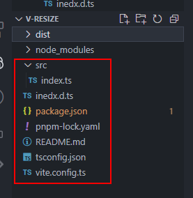
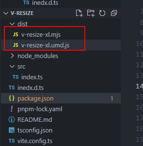

---

### 1.项目搭建

pnpm init 初始化生成 package.json

```shell
pnpm init
```

tsc --init 生成 tsconfig.json

```shell
tsc --init
```

分别执行

```shell
pnpm i vite -D
pnpm i vue -D
```

新建 vite.config.ts 和 index.d.ts 生命文件

目录结构如下



### 2. 实现监听元素大小变化

src/index.ts

```ts
import type { App } from 'vue'

function useResize(el: HTMLElement, callback: Function) {
  let resise = new ResizeObserver(entires => {
    callback(entires[0].contentRect) // 变化之后的宽高会放到contentRect属性中
  })
  resise.observe(el)
}

const install = (app: App) => {
  app.directive('resize', {
    mounted(el, binding) {
      useResize(el, binding.value)
    }
  })
}
useResize.install = install

export default useResize
```

index.d.ts 声明文件

```ts
declare const useResize: {
  (element: HTMLElement, callback: Function): void
  install: (app: App) => void
}

export default useResize
```

vite.config.ts 配置

```ts
import { defineConfig } from 'vite'
export default defineConfig({
  build: {
    lib: {
      entry: 'src/index.ts',
      name: 'useResize'
    },
    rollupOptions: {
      // 确保外部化处理那些你不想打包进库的依赖
      external: ['vue'],
      output: {
        // 在 UMD 构建模式下为这些外部化的依赖提供一个全局变量
        globals: {
          useResize: 'useResize'
        }
      }
    }
  }
})
```

package.json 配置

```json
{
  "name": "v-resize-xly",
  "version": "0.0.1",
  "description": "",
  "main": "dist/v-resize-xl.umd.js",
  "module": "dist/v-resize-xl.mjs",
  "scripts": {
    "test": "echo \"Error: no test specified\" && exit 1",
    "build": "vite build"
  },
  "keywords": [],
  "author": "",
  "files": ["dist", "index.d.ts"],
  "license": "ISC",
  "devDependencies": {
    "vite": "^4.4.11",
    "vue": "^3.3.4"
  }
}
```

### 3.打包

执行`npm run build`生成


### 4.发布到 npm

登录 npm 执行

```shell
npm login
```

接着执行

```shell
npm publish
```

ps: 出现错误时请检查发布的名称是否已经存在 npm 网站上，镜像也需切回官网镜像否则会发布失败。

### 5.使用

vue 中安装

```shell
pnpm i v-resize-xly
```

---
